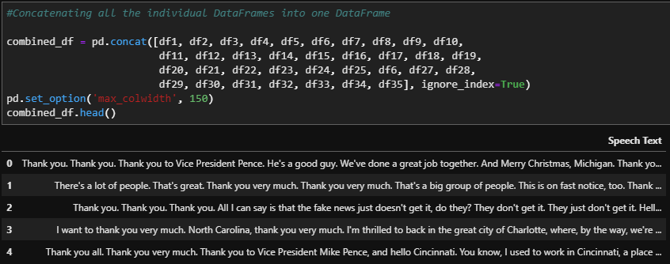
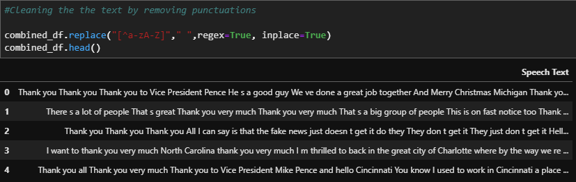
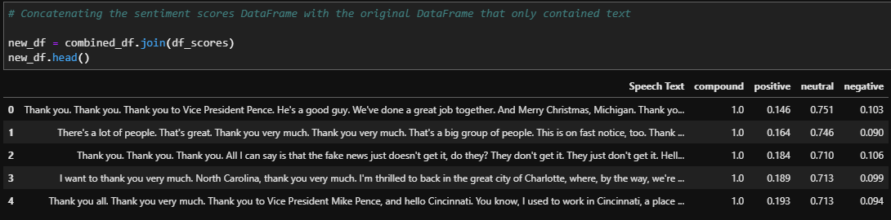
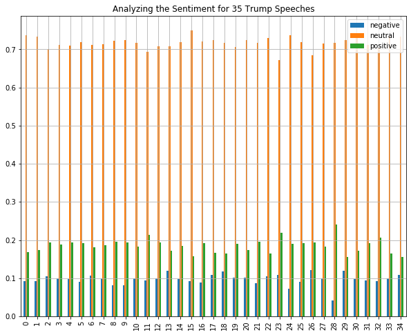
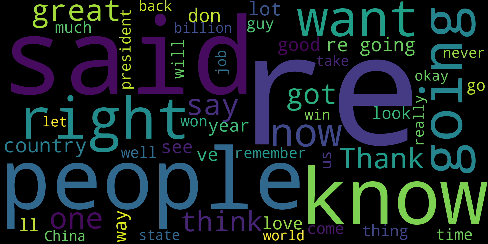

# Performing Sentiment Analysis on 35 Trump Campaign Speeches and Generating a Wordcloud 

Kaggle provides a number of great datasets. I found someone that posted 35 of Trump's campaign speeches in 2019 and 2020. Given how close the election was and how divisive Trump is considered by many, I thought it would be interesting to perform NLP and sentiment analysis on the speeches. 

Source: https://www.kaggle.com/christianlillelund/donald-trumps-rallies

## Steps Taken to Perform the Analysis
The Kaggle dataset provided 35 text documents with each text document containing one speech that Trump gave across various cities in the U.S.

I read in the the individual speeches, converting each speech into one large, concatenated string, and stored them into a DataFrame:

I then converted cleaned the text by removing punctuations:

Now the text is clean enough to perform the analysis. 

# Steps Taken to Perform the Sentiment Analysis

The analyis was performed using the NLKT (Natural Language Tool Kit), a popular Python library used to analyze human language data. Within the NLTK library there is a popular model called VADER (Valence Aware Dictionary And Sentiment Reasoner), which uses a lexical approach to analyze text. Words are labeled according to their semantic orientation as either positive or negative and the VADER provides an overall assessment of how positive or negative is the sentiment.

There are some pros and cons to using the VADER model which include:

Pros:
- Easy to understand approach and quick to implement

Cons:
- Misspellings and grammatical mistakes can cause the analysis to overlook words or usage

For more information here is a great article on the pros and cons of the VADER model:

https://www.codeproject.com/Articles/5269447/Pros-and-Cons-of-NLTK-Sentiment-Analysis-with-VADE

Lastly, I generated sentiment scores for each speech, appended them to empty lists, and then attached the sentiment scores to new DataFrame. This DataFrame was combined with the orignal DataFrame:

## Conclusion:

To my surprise the speeches were largely rated as "neutral". 

The VADER model scores text using scores the postivity, negativity and neutrality of each article by assigning a percentage. The three numbers combined must equal 100%. The average scores for each text were:

- 17.9% positive	
- 72.4% neutral	
- 9.7% negative

Below is a plot showing how there was not much variation in the scoring among the 35 speeches:

## Visualizing Trump's Campaign Speeches with a WordCloud

The WordCloud highlights how Trump's most commonly used words are ones we see in the media such as "win", "China" and "great". The WordCloud also illustrates how Trump's campaign speeches contain words that are shorter in length. This is confirmed by an article that quotes an author who says that Trump does this on purpose to drive his point [dictionary.com!](https://www.dictionary.com/e/s/trumps-favorite-words-trump-speak/#the-unique-vocabulary-of-donald-j-trump):

"As President, Trump receives a lot of attention for his use of words—especially since he continues to hold campaign rallies. In Trump and Us: What He Says and Why People Listen, professor Roderick Hart argues that Trump “turned the rant into an art form,” and relies on using both a lot of words and short words to convey his point."

